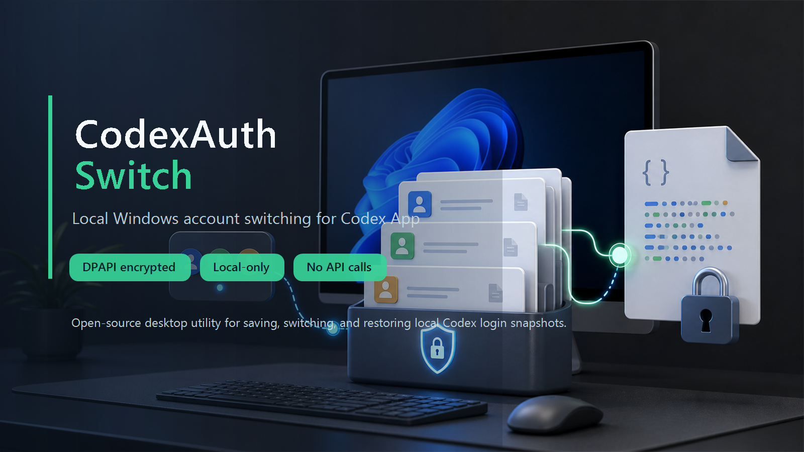
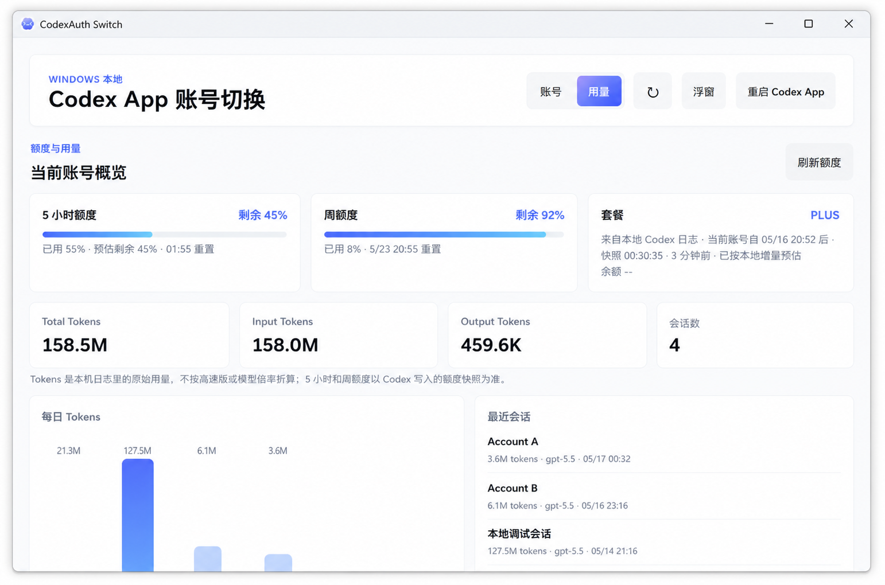
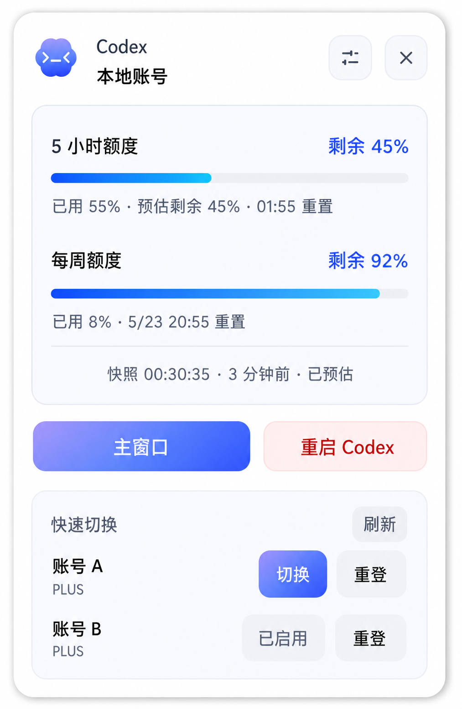

# CodexAuth Switch

## 0.1.7: local compatibility and statistics

- Quotas are separated by limit ID, with correct weekly-only window placement. Null usage means unknown.
- Token totals use event deltas across sessions and archived sessions, with copied-event deduplication, per-model/day attribution and gzip/Zstandard support where the runtime supports it. Cached input and reasoning output are subsets, not additional tokens. Exact counts and scan coverage are shown. Counter resets or missing baselines are reported rather than guessed.
- Quota estimates learn only from this account's local samples for the same model, explicit speed tier, limit ID and window. Unknown/new models do not inherit GPT-5.5 prices. At least three local samples are required; snapshots remain visible without calibration.
- Earned reset counts are shown only from structured local Codex records. Missing data is Unknown, not zero. Stale or expired records are labeled; there are no online queries or reset-redemption actions.
- Local diagnostics show the running app version, credential sync and log availability. A corrupted account index is recovered from decryptable snapshots after preserving the damaged index and encrypted blobs in a recovery directory.
- Run `npm run local-data:validate` for the fixture-based parser, recovery and integration checks.




English README | [中文说明](README.md)

CodexAuth Switch is a local Windows and macOS desktop utility for quickly switching between multiple Codex App login accounts.

It is designed for people who use more than one OpenAI / Codex App account. You can save each account's local login state, then switch the active Codex login through this tool. The app only operates on local files. Quota and usage views come from local Codex logs; it does not call remote quota endpoints or upload Codex conversation history.

One-line positioning: **CodexAuth Switch is a local-first Codex App multi-account switcher with `auth.json` snapshot management, Windows DPAPI / macOS Keychain encryption, quota display, and token usage statistics.**

> This is an unofficial project and is not affiliated with OpenAI.

## Who It Is For

- Users who manage multiple Codex App login accounts on Windows or macOS.
- Users who want to switch the active OpenAI Codex / Codex App account quickly.
- Users who want to safely save and restore local `~/.codex/auth.json` login snapshots.
- Users who want to view local Codex quota, 5-hour quota, weekly quota, Reviews, model-level limits, token usage, and recent sessions.
- Users who want local log estimation without sending tokens, account data, or conversation history to remote quota endpoints.

## Search Keywords

Codex account switcher, Codex multi account, Codex App account manager, OpenAI Codex account switcher, Codex auth.json switcher, Codex local login manager, Codex quota viewer, Codex token usage dashboard, Codex Windows macOS desktop app, Codex DPAPI Keychain encryption, Codex local quota estimate, Codex local quota tracking, Codex local history read-only.

## Features

- Import the current Codex App login state.
- Save multiple local account snapshots.
- Switch the active Codex login by replacing `~/.codex/auth.json`.
- Encrypt saved credentials with Windows DPAPI or macOS Keychain-backed system storage, readable only by the current operating-system user.
- Automatically back up the original `auth.json` before switching, reauth, or deleting the active account.
- Provide a main window, system tray menu, and floating quick-view widget.
- Read quota and token usage from local Codex logs.
- Cache parsed local token events by file size and modification time to reduce repeated scans.
- Show quota pace hints, Reviews, and model-level limit cards.
- Disable network requests in renderer pages; quota reading also stays local-only.

## Screenshots

| Main Window | Floating Quick View |
| --- | --- |
|  |  |

## Safety Boundary

CodexAuth Switch is intentionally scoped to the local Codex login file and the app's own storage directory.

### Files It Writes

- `~/.codex/auth.json`
  - The active local login file used by Codex App.
  - During account switching, the app replaces this file with a saved account snapshot.
- `~/.codex/config.toml`
  - Ensures the top-level setting contains `cli_auth_credentials_store = "file"` so current Codex releases continue using switchable `auth.json` credentials.
  - Creates a timestamped `config.toml.codexauth-backup-*` copy in the same directory before changing the file.
- App account metadata: `%APPDATA%\codex-auth-switcher\accounts.json` on Windows; `~/Library/Application Support/codex-auth-switcher/accounts.json` on macOS.
- Encrypted account snapshots: `%APPDATA%\codex-auth-switcher\accounts\*.dpapi` on Windows; `~/Library/Application Support/codex-auth-switcher/accounts/*.keychain` on macOS.
- Encrypted backups created before operating on the active account: `%APPDATA%\codex-auth-switcher\backups\*.dpapi` on Windows; `~/Library/Application Support/codex-auth-switcher/backups/*.keychain` on macOS.

### Files It Only Reads

- `~/.codex/auth.json`
  - Used to import the current login and identify the account.
- `~/.codex/sessions/**/rollout-*.jsonl`
  - Used for local usage and quota snapshot calculation.
- `~/.codex/session_index.jsonl`
  - Used to enrich local session metadata when available.
- `~/.codex/logs_2.sqlite`
  - Opened in read-only mode to read local Codex quota events.

### What It Does Not Do

- It does not modify Codex conversation history.
- It does not delete `~/.codex/sessions`.
- It does not write to `logs_2.sqlite`.
- It does not upload tokens, account data, session logs, or usage records.
- It does not use the current access token to request remote quota endpoints.
- It does not refresh OpenAI tokens by itself.
- It does not call remote quota endpoints.

The only features that intentionally affect Codex App runtime state are account switching, reauth, deleting the active account, and restarting Codex App. These actions may update `config.toml`, replace or remove the current `auth.json`, and restart Codex App so the new local login state takes effect.

## How It Works

### Account Identification

When importing the current login, the app reads `~/.codex/auth.json` and validates that it matches Codex App's ChatGPT login format.

It parses JWT payloads locally and extracts fields such as email, user ID, and workspace/account ID. Account matching does not rely on a single claim. It combines personal identity and workspace identity when possible, because one person can belong to multiple workspaces and one workspace can contain multiple users.

### Credential Storage

The app does not store `auth.json` in plain text. Windows uses DPAPI; macOS uses Electron `safeStorage` backed by the system Keychain.

Windows uses `DataProtectionScope.CurrentUser`; macOS uses the current user's Keychain.

This binds encrypted snapshots to the current operating-system user. Other users, machines, or operating systems cannot directly decrypt them.

Saved account snapshots are stored in:

- Windows: `%APPDATA%\codex-auth-switcher\accounts`
- macOS: `~/Library/Application Support/codex-auth-switcher/accounts`

Backups created before operating on the active login are stored in:

- Windows: `%APPDATA%\codex-auth-switcher\backups`
- macOS: `~/Library/Application Support/codex-auth-switcher/backups`

The app does not call an OpenAI token-refresh endpoint itself. Codex refreshes access and refresh tokens during actual use; CodexAuth Switch watches the current `auth.json` and re-encrypts updated contents into the matching account snapshot. An expired access token alone does not mean the login is invalid—reauth is needed only when Codex can no longer refresh it.

The newest 60 encrypted backups are retained. Atomic-write temporary files older than one hour are cleaned at startup so long-running switching and usage tracking do not create unbounded cache growth.

### Account Switching Flow

When switching accounts, the app:

1. Reads the current `~/.codex/auth.json`.
2. Creates a backup encrypted by the current platform's secure storage if a login exists.
3. Decrypts the selected account snapshot.
4. Validates that the snapshot is a valid Codex login file.
5. Writes the snapshot to a temporary file.
6. Atomically renames the temporary file to `~/.codex/auth.json`.
7. Restarts Codex App if the user chooses to do so.

The temporary-file plus atomic-rename approach reduces the chance that Codex App reads a partially written `auth.json`.

On Windows, restart stops the desktop process group belonging to the Codex installation. On macOS, it detects the current `ChatGPT` or legacy `Codex` application process, waits for it to exit, and relaunches it through Launch Services.

### Reauth Flow

If a saved account's refresh token becomes invalid, the app can start a reauth flow:

1. Back up the current `auth.json`.
2. Delete the current local `auth.json`.
3. Restart Codex App.
4. Let the user complete the official login flow inside Codex App.
5. After Codex App writes a fresh `auth.json`, CodexAuth Switch watches for it and saves it back to the matching account.

This does not bypass or replace official login. The real login still happens inside Codex App.

### Quota Mode

The quota panel uses local estimate mode only. It reads logs already written by Codex App and does not request `chatgpt.com` or any other remote quota endpoint.

### Local Quota And Usage

Local estimate mode reads:

- `codex.rate_limits` records in session JSONL files.
- `codex.rate_limits` and usage-limit records in the latest automatically discovered `logs_N.sqlite`.
- `token_count` events in session files.
- Complete log events, cached by file size and modification time and deduplicated across files. Account metadata stores quota snapshots and calibration samples isolated by model and service tier. The legacy `local-token-ledger.json` no longer participates in statistics.

The app watches local log file changes with a short debounce and uses a low-frequency SQLite modification-time polling fallback to avoid missed filesystem events.

Quota snapshots are saved only into this app's own account metadata. They are not written back to Codex log files.

Multi-account statistics use the most recent account-switch time as their boundary. A session that continues across a switch is attributed through adjacent token-snapshot deltas, and quota calibration combines only post-switch events with that account's own saved learning so same-plan accounts do not leak into each other.

### Quota Pace Hints

The app uses the current used percentage, quota window length, and reset time to estimate consumption pace. It can show whether usage is light, on track, or likely to run out early. This is a trend hint, not a promise of how much quota the next request will consume.

### Network Isolation

Electron windows use these security settings:

```js
contextIsolation: true
nodeIntegration: false
sandbox: true
webSecurity: true
```

The page CSP disables network connections:

```html
connect-src 'none'
```

The main process also installs an Electron `webRequest.onBeforeRequest` guard that cancels outbound requests for:

```text
http://
https://
ws://
wss://
```

These restrictions keep renderer pages local-only and help prevent account data or local history from being uploaded. Quota reading also stays local-only.

## Usage

### Install Dependencies

```powershell
npm install
```

### Start The App

```powershell
npm start
```

Hidden local debug start on Windows:

```powershell
npm run dev:hidden
```

### Import Accounts

1. Open Codex App and sign in to the first account.
2. Open CodexAuth Switch.
3. Click the button that imports the current Codex login.
4. Return to Codex App, sign out, and sign in to another account.
5. Return to CodexAuth Switch and import again.
6. Repeat for every account you want to save.

### Switch Accounts

1. Select a saved account in CodexAuth Switch.
2. Click switch.
3. Restart Codex App if needed.

The app pins current Codex releases to file-backed credentials and fully restarts the desktop app when “restart after switch” is enabled, so the selected account takes effect after relaunch.

### Reauth A Saved Account

Use reauth when Codex reports that a refresh token can no longer be refreshed, or when a saved account has become stale.

The app clears the current local login and restarts Codex App. You then complete the official login inside Codex App. After Codex writes a new `auth.json`, CodexAuth Switch captures and saves it.

## Development

### Syntax Check

```powershell
npm run lint
```

### Validate Quota Logic

```powershell
npm run local-data:validate
```

This command uses isolated fixtures to validate token deltas, duplicates and forks, account boundaries, quota pools, weekly windows, reset-credit provenance, calibration and account recovery. `quota:validate` remains a historical replay of the old price-weighted algorithm, not validation of the current algorithm.

### Build Windows Installer

```powershell
npm run pack:win
```

### Build macOS DMGs

Run this command on macOS:

```bash
npm run pack:mac
```

It creates DMGs for Intel (`x64`) and Apple Silicon (`arm64`).

The installers are written to:

```text
release/
```

The `release` directory is a local build artifact and is not committed to Git by default.

## Project Structure

```text
src/main.js                         Electron main process, local file access, account switching, quota logic
src/preload.js                      Safe IPC bridge
src/ui/index.html                   Main window page
src/ui/app.js                       Main window renderer logic
src/ui/widget.html                  Floating quick-view widget page
src/ui/widget.js                    Floating widget renderer logic
scripts/generate-icon.js            Local icon generation
scripts/start-dev-hidden.ps1        Hidden debug start script
scripts/validate-quota-estimate.js  Quota replay validation script
QUOTA-LOGIC.md                      Quota-estimation notes
```

## Limitations

- Windows and macOS are supported; Linux is not currently supported.
- Encrypted snapshots are bound to the current system user and cannot be copied directly across machines or platforms.
- This targets Codex App local login switching, not Codex CLI-only workflows.
- Local estimate mode is a best-effort interpretation of local logs.
- Quota snapshots may stay stale until Codex writes new local rate-limit records.
- Do not share saved credential snapshots across machines or operating-system users.

## Release

Windows installers and Intel / Apple Silicon macOS DMGs are uploaded through GitHub Releases. The current builds are not commercially code-signed or Apple-notarized, so the operating system may show a security warning.

## License

MIT License. See [LICENSE](LICENSE).

## Responsible Use

Only save and switch accounts that you own or are authorized to use. Do not share `auth.json`, encrypted snapshots, or backup files with other people.
