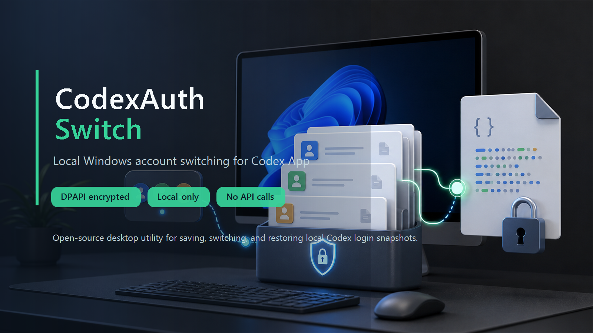
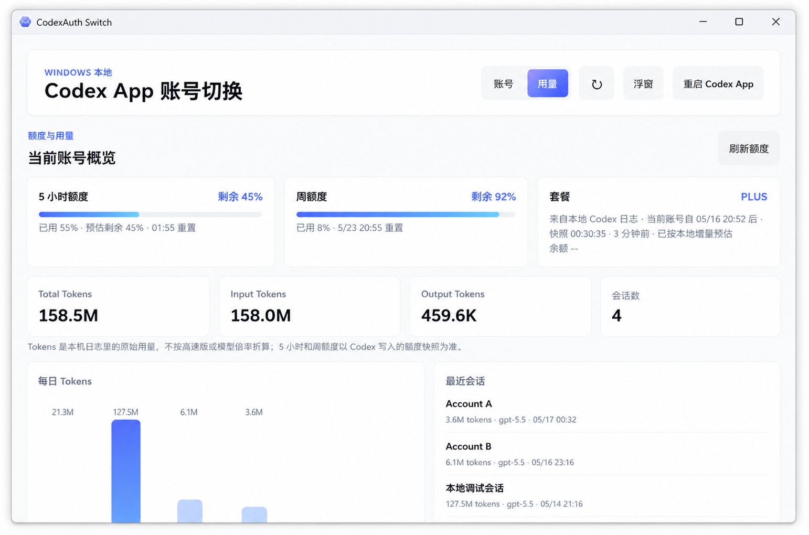
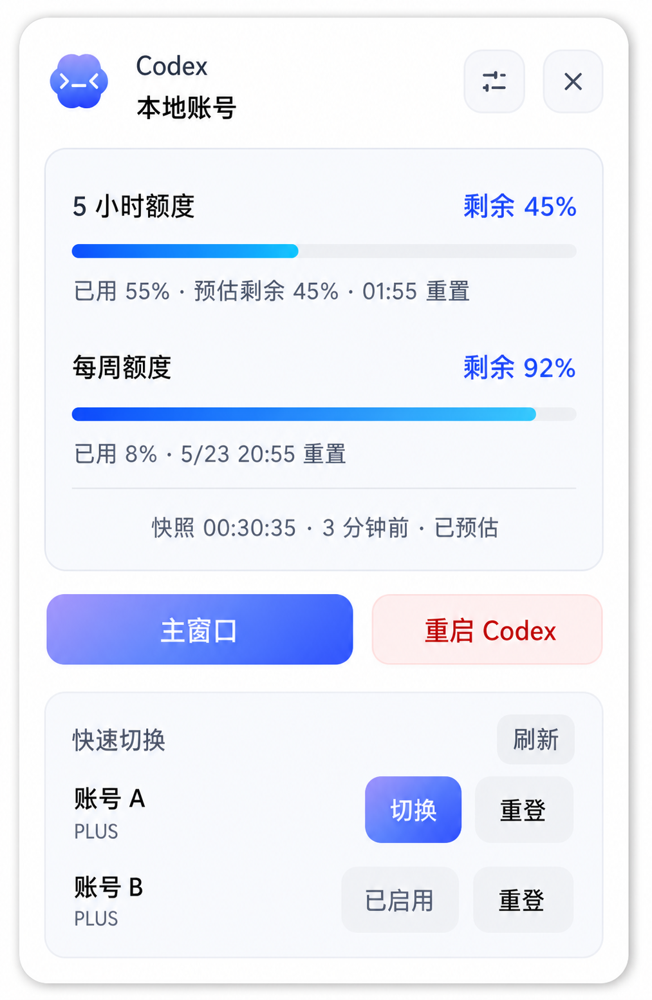

# CodexAuth Switch



[English README](README.en.md) | 中文说明

CodexAuth Switch 是一个 Windows 本地桌面工具，用来在多个 Codex App 登录账号之间快速切换。

它适合同时使用多个 OpenAI / Codex App 账号的人：先把每个账号的本地登录状态保存下来，之后通过这个工具切换当前生效的 Codex 登录。应用只操作本机文件，额度和用量来自本地 Codex 日志解析，不请求远程额度接口，也不会上传 Codex 会话历史。

一句话定位：**CodexAuth Switch 是一个本地优先的 Codex App 多账号切换工具，支持 `auth.json` 快照管理、Windows DPAPI 加密、额度查看和 token 用量统计。**

> 这是非官方项目，与 OpenAI 无官方关联。

## 适合谁

- 想在 Windows 上管理多个 Codex App 登录账号。
- 想快速切换 OpenAI Codex / Codex App 当前账号。
- 想安全保存和恢复本地 `%USERPROFILE%\.codex\auth.json` 登录快照。
- 想查看 Codex 本地额度、5 小时额度、周额度、Reviews、模型级额度、token 用量和最近会话。
- 想坚持本地日志估算，不把 token、账号信息或会话历史发到远程额度接口。

## 常见搜索词

Codex 账号切换、Codex 多账号、Codex App 账号管理、OpenAI Codex 账号切换工具、Codex auth.json 切换、Codex 本地登录管理、Codex 额度查看、Codex token 用量统计、Codex Windows 桌面工具、Codex DPAPI 加密、Codex 本地预估、Codex 本地额度估算、Codex 本地历史只读。

## 功能

- 导入当前 Codex App 登录状态。
- 保存多个本地账号快照。
- 通过替换 `%USERPROFILE%\.codex\auth.json` 切换当前 Codex 登录。
- 使用 Windows DPAPI 加密保存账号凭据，仅当前 Windows 用户可解密。
- 切换、重新登录、删除当前账号前自动备份原始 `auth.json`。
- 提供主窗口、系统托盘菜单和悬浮快捷窗。
- 从本地 Codex 日志读取额度和 token 使用情况。
- 使用本地 token 事件索引辅助额度预估，减少重复扫描并提升刷新稳定性。
- 显示额度消耗 pace 提示、Reviews 和模型级额度。
- 渲染页面禁用网络请求；额度读取路径也保持本地-only。

## 界面截图

| 主窗口 | 悬浮快捷窗 |
| --- | --- |
|  |  |

## 安全边界

CodexAuth Switch 的设计目标是把影响范围限制在本机登录文件和本应用自己的存储目录内。

### 会写入的文件

- `%USERPROFILE%\.codex\auth.json`
  - Codex App 当前使用的本地登录文件。
  - 切换账号时，应用会用已保存的账号快照替换这个文件。
- `%APPDATA%\codex-auth-switcher\accounts.json`
  - 本应用的账号元数据。
- `%APPDATA%\codex-auth-switcher\accounts\*.dpapi`
  - 使用 DPAPI 加密后的账号凭据快照。
- `%APPDATA%\codex-auth-switcher\backups\*.dpapi`
  - 切换、重新登录、删除当前账号前生成的加密备份。

### 只读取的文件

- `%USERPROFILE%\.codex\auth.json`
  - 用于导入当前登录、识别账号身份。
- `%USERPROFILE%\.codex\sessions\**\rollout-*.jsonl`
  - 用于本地统计用量和额度快照。
- `%USERPROFILE%\.codex\session_index.jsonl`
  - 存在时用于补充本地会话元数据。
- `%USERPROFILE%\.codex\logs_2.sqlite`
  - 以只读方式打开，用于读取 Codex 本地写入的额度事件。

### 不会做的事

- 不修改 Codex 会话历史。
- 不删除 `%USERPROFILE%\.codex\sessions`。
- 不写入 `logs_2.sqlite`。
- 不上传 token、账号信息、会话日志或用量记录。
- 不使用当前 access token 请求远程额度接口。
- 不自行刷新 OpenAI token。
- 不调用远程额度接口。

会影响 Codex App 当前运行状态的功能只有：切换账号、重新登录、删除当前账号、重启 Codex App。这些操作可能会替换或移除当前 `auth.json`，并重启 Codex App，让新的本地登录状态生效。

## 实现方法

### 账号识别

导入当前登录时，应用会读取 `%USERPROFILE%\.codex\auth.json`，并验证它是否是 Codex App 的 ChatGPT 登录格式。

应用会在本地解析 JWT payload，提取邮箱、用户 ID、workspace/account ID 等字段。账号匹配不会只依赖单个字段，而是尽量组合个人身份和工作区身份，因为同一个人可能加入多个工作区，同一个工作区也可能包含多个成员。

### 凭据保存

保存账号时，应用不会明文存储 `auth.json`。它会调用 Windows DPAPI：

```text
DataProtectionScope.CurrentUser
```

这表示加密后的账号快照绑定到当前 Windows 用户。其他 Windows 用户或其他机器不能直接解密。

账号快照存储在：

```text
%APPDATA%\codex-auth-switcher\accounts
```

操作当前登录前的备份存储在：

```text
%APPDATA%\codex-auth-switcher\backups
```

### 账号切换流程

切换账号时，应用会执行以下步骤：

1. 读取当前 `%USERPROFILE%\.codex\auth.json`。
2. 如果当前登录存在，先生成 DPAPI 加密备份。
3. 解密目标账号的本地快照。
4. 校验目标快照是否是有效的 Codex 登录文件。
5. 先写入临时文件。
6. 再通过原子重命名替换 `%USERPROFILE%\.codex\auth.json`。
7. 根据用户选择重启 Codex App。

使用临时文件加原子替换，是为了避免 Codex App 读到写入一半的 `auth.json`。

### 重新登录流程

如果某个已保存账号的 refresh token 失效，应用可以发起重新登录流程：

1. 备份当前 `auth.json`。
2. 删除当前本地 `auth.json`。
3. 重启 Codex App。
4. 用户在 Codex App 里走官方登录流程。
5. Codex App 写入新的 `auth.json` 后，CodexAuth Switch 自动监听并保存到对应账号。

这个过程不绕过官方登录，也不代替官方登录。真正的登录仍然发生在 Codex App 内。

### 额度读取模式

额度面板采用本地预估模式，只读取 Codex App 已经写到本机的日志，不请求 `chatgpt.com` 或其他远程额度接口。

### 本地额度和用量统计

本地预估模式读取以下数据：

- session JSONL 文件里的 `codex.rate_limits`。
- `logs_2.sqlite` 里的 `codex.rate_limits` 和 usage-limit 记录。
- session 文件里的 `token_count` 事件。
- 应用本地目录里的 `local-token-ledger.json`，只保存 token 计数、模型、时间、rate-limit 快照和文件状态，用于增量去重和更稳定的本地估算。

应用会监听本地日志文件变化，并用短延迟防抖刷新显示；同时用低频轮询检查 SQLite 文件更新时间，避免文件监听漏事件。

额度快照只保存到本应用自己的账号元数据中，不会写回 Codex 的日志文件。

### 额度 pace 提示

应用会根据当前已用百分比、额度窗口长度和重置时间估算当前消耗速度，显示“消耗速度宽松 / 消耗速度正常 / 按当前速度会提前用完”。这只是趋势提示，不代表下一次对话会准确消耗多少额度。

### 网络隔离

Electron 窗口启用了以下安全配置：

```js
contextIsolation: true
nodeIntegration: false
sandbox: true
webSecurity: true
```

页面 CSP 禁止网络连接：

```html
connect-src 'none'
```

主进程还通过 Electron `webRequest.onBeforeRequest` 拦截并取消以下出站请求：

```text
http://
https://
ws://
wss://
```

这些限制用于确保渲染页面保持本地工具属性，避免账号信息或本地历史被上传。额度读取同样保持本地-only。

## 使用方法

### 安装依赖

```powershell
npm install
```

### 启动应用

```powershell
npm start
```

本地隐藏调试启动：

```powershell
npm run dev:hidden
```

### 导入账号

1. 打开 Codex App，并登录第一个账号。
2. 打开 CodexAuth Switch。
3. 点击导入当前 Codex 登录。
4. 回到 Codex App，退出并登录另一个账号。
5. 再回到 CodexAuth Switch，继续导入当前登录。
6. 重复以上步骤，保存所有需要切换的账号。

### 切换账号

1. 在 CodexAuth Switch 中选择一个已保存账号。
2. 点击切换。
3. 如果 Codex App 仍显示旧账号，重启 Codex App。

如果 Codex App 已经把旧登录加载进内存，通常需要重启 Codex App 后，新账号才会生效。

### 重新登录已保存账号

当 Codex 提示 refresh token 无法刷新，或某个保存账号已经失效时，使用重新登录功能。

应用会清理当前本地登录并重启 Codex App。你只需要在 Codex App 里正常完成官方登录，新的 `auth.json` 写入后会被 CodexAuth Switch 捕获并保存。

## 开发

### 语法检查

```powershell
npm run lint
```

### 校验额度逻辑

```powershell
npm run quota:validate
```

这个命令会回放本机 `.codex` session 日志，检查额度估算逻辑。它只读取本地会话文件，不会写入这些文件。

### 打包 Windows 安装器

```powershell
npm run pack:win
```

安装包输出到：

```text
release\
```

`release` 目录是本地构建产物，默认不提交到 Git。

## 项目结构

```text
src/main.js                         Electron 主进程，本地文件访问、账号切换、额度逻辑
src/preload.js                      安全 IPC bridge
src/ui/index.html                   主窗口页面
src/ui/app.js                       主窗口渲染逻辑
src/ui/widget.html                  悬浮快捷窗页面
src/ui/widget.js                    悬浮快捷窗渲染逻辑
scripts/generate-icon.js            本地图标生成
scripts/start-dev-hidden.ps1        隐藏调试启动脚本
scripts/validate-quota-estimate.js  额度逻辑回放校验脚本
QUOTA-LOGIC.md                      额度估算逻辑说明
```

## 限制

- 目前只支持 Windows。
- 凭据加密依赖 Windows DPAPI。
- 目标是 Codex App 本地登录切换，不是 Codex CLI-only 工作流。
- 本地预估模式来自本地日志解析，属于本地近似展示。
- Codex 没有写入新的本地 rate-limit 记录时，额度快照可能暂时不更新。
- 不要跨机器或跨 Windows 用户共享已保存的凭据快照。

## Release

Windows 安装包会随 GitHub Release 上传。安装器未做商业代码签名，Windows 可能会显示安全提醒。

## License

MIT License. See [LICENSE](LICENSE).

## 使用提醒

请只保存和切换你自己拥有或被授权使用的账号。不要把 `auth.json`、加密快照、备份文件分享给其他人。
